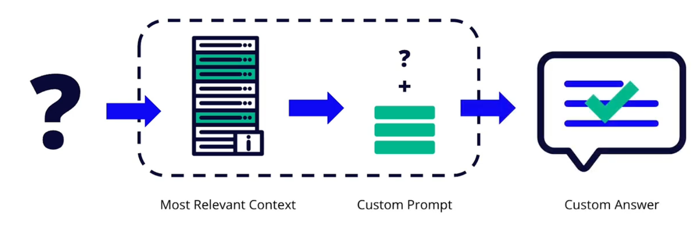
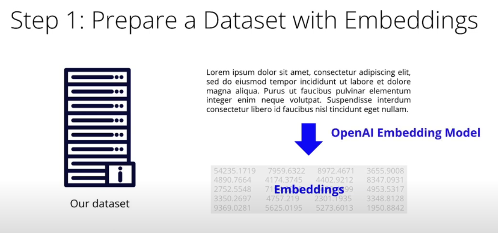
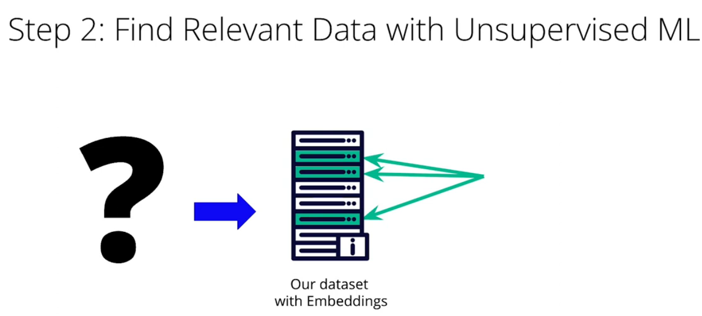
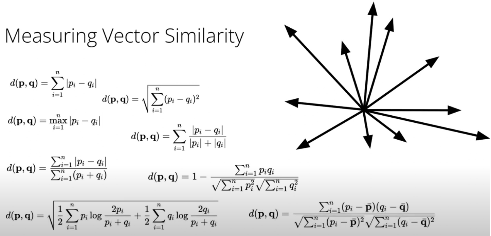
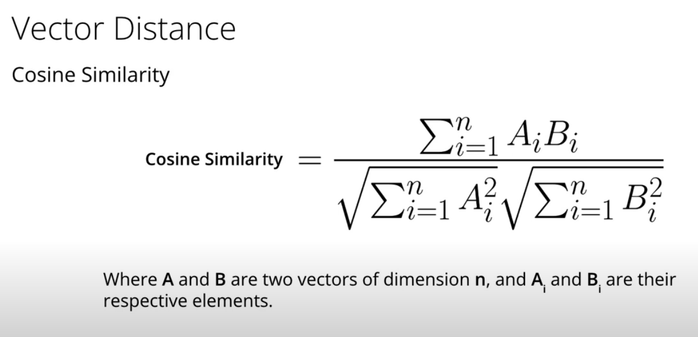
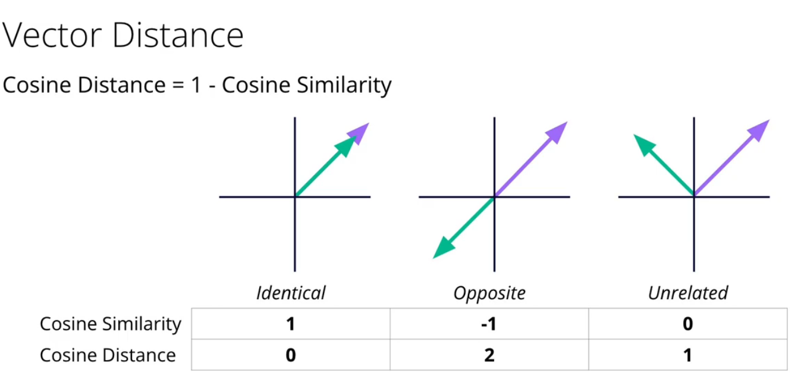
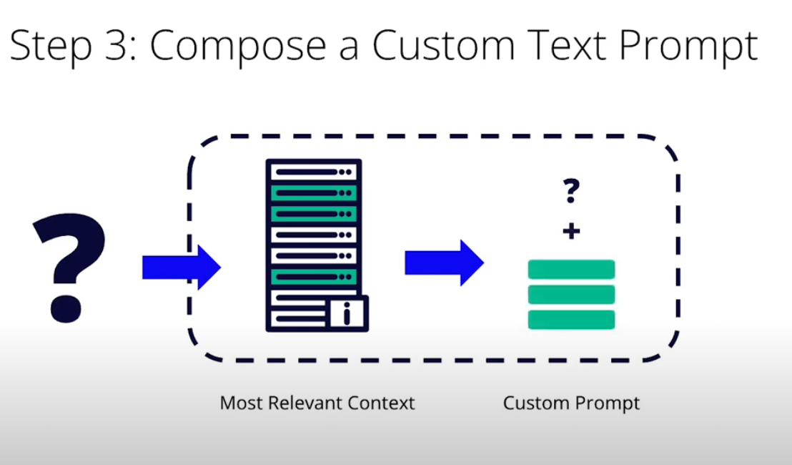
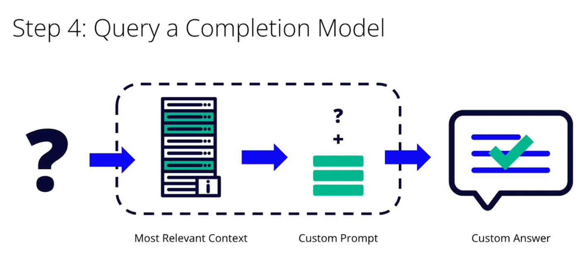
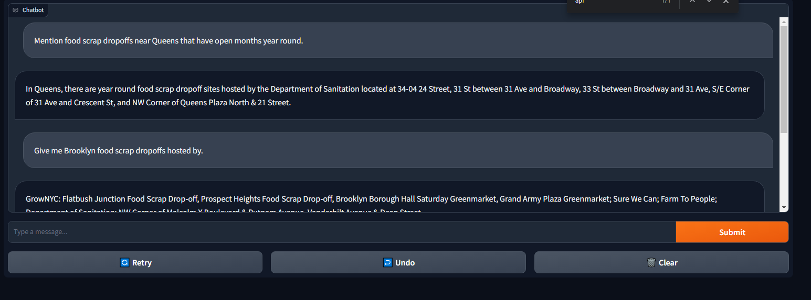

 <b>Project Overview: Build Your Own Custom Chatbot<b>

In this project we will use a custom dataset to build your a custom chatbot.

We will have a custom OpenAI chatbot using a scenario for a Food Scrap Dropoff. 

*The data selected was the **nyc_food_scrap_drop_off_sites.csv**, we selected this dataset because here in our country there are some dropoff for reciclying and is difficult to know when and how there are, who host this events and when and how are open to public.*

We will incorporate the data source into the custom chatbot code, and write questions to demonstrate the performance of the custom prompt.

 <b>Project Summary<b>

#### Data Sources

There are two main data sources that you could use for this project: Wikipedia API and CSV data.

The Wikipedia API will be most similar to the examples shown in the demos and exercises you have previously seen. You can use any article other than 2022 or 2023 Syria-Turkey Earthquake as long as it fulfills the requirements.

On the **data** directory we have some CSV files that you could use for another project. These are:

- *2023_fashion_trends.csv* - this file contains reports and quotes about fashion trends for 2023. Each row includes the source URL, article title, and text snippet.
- *character_descriptions.csv* - this file contains character descriptions from theater, television, and film productions. Each row contains the name, description, medium, and setting. All characters were invented by an OpenAI model.
- *nyc_food_scrap_drop_off_sites.csv* - this file contains locations, hours, and other information about food scrap drop-off sites in New York City. This information was retrieved in early 2023, and you can also get the latest version from this open data portal as explained in the notebook. 

As an idea, we may also source more data. For example, we could do web scrapping or add other documents you we have on hand. The final dataset has 576 rows and OpenAI language models are not optimized for numeric or logical reasoning, so number-heavy data like budgets, sensor data, or inventory are not appropriate.

#### Custom Scenario

In addition to the technical component of preparing and incorporating this new dataset, we also explain why this dataset is appropriate as in the first part why is appropiate. 

Because in the end, the model responds in different way regardless of whether custom data is provided, that means that the dataset was appropriate for the task.

If you look at the notebook of the custom chatbot we explain at the beginning why this dataset is a good choice.

At the end of the notebook, we will demonstrate the model Q&A before and after the customization has been performed in order to highlight the changes using default prompting and later a customized embeddings chatbot with expanded data.

#### How to Develop a Custom Chatbot (this is called AKA Knowledge Based)

The end of the project was to develop a custom chatbot.  The chatbot that we will use is based on embeddings. Given a prompt (or question), we will retrieve the most relevant content of the corpus of documents and prepare a custom prompt, finally with this prompt and injection to the model we will have a different answer and more accurate given a predefined bot.

This project is prepared on several steps.  

**Step 1** involves to prepare the dataset using embeddings method.  For this we will use OpenAI embeddings model for implementing the embeddings, that is, transformint textual data into numerical data.

Embeddings is our prefered method because if we use correspondences or any other method like one hot encoding the disadvantage is that given the different words we will increase in column dimension and will eventually lead to exhaust the RAM due to growth of data.

On **Step 2**, based on this embeddings and a query we will find contextual matches based on similarities.

Later we will use the cosine similarity (in the end 1 - cosine_similarity will give us the distances of the documents/text).

**Step 3**, Involves using the relevance found in the previous step to make a custom prompt for the chatbot.

After preparing the previous steps, **Step 4** just injects the prompt to the chatbot and receive the final answer.

As a bonus we had implemented a final simple application using gradio

 <b>Files and Folders<b>

- **data**: datasets for different chatbots.
  - *2023_fashion_trends.csv*
  - *character_descriptions.csv*
  - *embeddings.csv**: result of the embeddings using opena API.
  - *nyc_food_scrap_drop_off_site.csv: food scrap dataset (this application)
- **doc**: contains all the images located in this document.
- **helpers**: contains all the chatter application class
  - *chatter.py*: chatbot using embeddings.
- **sample_chatbot**: complete pipeline by steps of a sample application if you want to learn from the scratch what is happending in depth.
  - *Chatbot Step 1 - Data Preparation - Embeddings.ipynb*: loads the data and prepare the embeddings for later use.
  - *Chatbot Step 2 - Find Relevant Data.ipynb*: using cosine distance we will find most similar relationships using embeddings.
  - *Chatbot Step 3 & 4 - Querying a Completion Model with a Custom Text Prompt.ipynb*: Develop a final request to our chatbot and get an answer
  - *Custom Chatbot Complete - casestudy.ipynb*: Complete chatbot pipeline.
  - *distance_sorted.csv*: result of a prompt answer, the embeddings and the cosine distance metric sorted by less distance to lower.
  - *distances.csv*: same result as above, but without sorting.
  - *embeddings.csv*: embeddings of the text document.
  - *text.csv*: extraction of the data of wikipedia news of 2022.
- **Gradio Notebook Development.ipynb**: Example of a notebook development using gradio.
- **NYC Food Scrap Dropoff Chatbot.ipynb**: Chatbot application development of a food scrap dropoff chatbot.
- **app_gradio.py**: stand alone file for running a gradio app.
- **Gradio Notebook Development.html**: same as the notebook but for clean loading
- **NYC Food Scrap Dropoff Chatbot.html**: same as the notebook but for clean loading
- **README.md**: This file, explanation of the project.
- **requirements.txt**: file for all the version used in this document.

 <b>What could be built to get the best of AI Chatbots<b>

This project is just the start. What else do you could build?

We could check out the [fine-tuning API](https://platform.openai.com/docs/guides/fine-tuning). This allows you to use your own labeled training data to customize the model outputs, applying a supervised machine learning approach also known as transfer learning. The training data for this kind of project would need to follow this format:

    {
      "prompt": "<prompt text>",
      "completion": "<ideal generated text>"
    }

and OpenAI recommends that you have "at least a couple hundred" prompt/completion examples before performing fine-tuning.

A detailed guide to fine tune a OpenAI model [can be found in this Datacamp post](https://www.datacamp.com/tutorial/fine-tuning-gpt-3-using-the-open-ai-api-and-python).

 <b>Instructions for running the notebook and application<b>

**Create an Environment and install dependencies**

    conda create -n chatbot python=3.8

    conda activate chatbot

    pip install -r requirements.txt

**Changes for Running the notebooks:**
- open the notebook of interest
- find and add the Openai API Key
- run the notebook

**Running the gradio app:**
- open the *helpers/chatter.py*
- add the OpenAI API Key on line 7 (*openai.api_key = 'sk-...'*)
- save and run the application
    python app_gradio.py

 <b>Video Explanation<b>

Knowledge Base Custom Chatbot

 <b>Contributing<b>

Your contributions are always welcome! Please feel free to fork and modify the content but remember to finally do a pull request.

 :iphone: <b>Having Problems?<b>

 

 <b>License<b>

